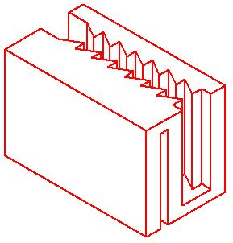

# Cable_holder
Cable holder 3D modell for my mouse cable

I created this cable holder to hold my mouse's cable (dia.: 3mm)

Maybe the wall thickness is a little bit op., but it does the job. It is clipped on a 1.4mm thick sheet metal (this is my monitor stand).

I printed it on a stock Ender 3 v2

For slicing I used Cure (latest one on 30/11/2021), everything on stock settings. I only changed the <Build plate adhesion> to <Brim>, because I wanted to be sure the thin left side, that cantacts with the bed, won't move after the first layer.
